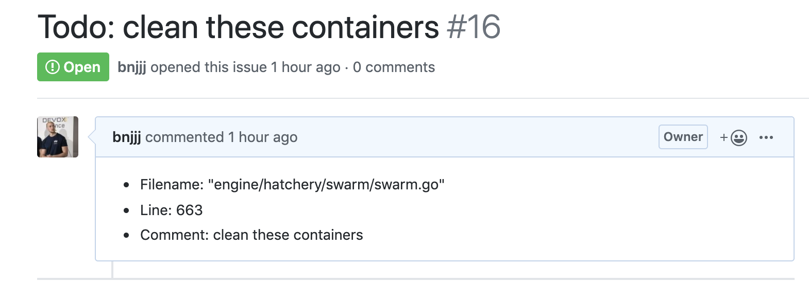

# FIXME report

Here is a simple tool to automate issues creation directly from `// TODO` and `// FIXME` comments in your code. Too often you write these kinds of comments but are never deleted or even taking in account for next milestone. Note you can also assign your issues to an assignee by indicating a comment with this syntax `// TODO (@bnjjj): clean this function` For now it only support GitHub issue creation but check the [roadmap](#roadmap) for next supports.

## Configuration

Save your configuration in a json file like this for example:

```json
{
    "type": "github",
    "repository": "bnjjj/fixme_report",
    "token": "PERSONAL_TOKEN_FROM_GITHUB",
    "username": "bnjjj",
    "url": "https://github.com"
}
```

You can save it into a file named `fixme_settings.json` file in the same directory of your usage. If not you can use flag to indicate the path to your configuration file like this `fixme_report -c $HOME/my_settings.json`.

## Usage

Default behavior is to read a patchset (git diff) directly from stdin. If you want to specify a `.patch` file you can indicate this file with `-f=yourFile.patch` to the CLI.

Example if you want to create issues checking your last commit:

```bash
$ git diff HEAD^1 HEAD | fixme_report
```

The main idea is to put this CLI in your CI/CD pipeline to launch on every commit merged on master for example.


```bash
USAGE:
    fixme_report [FLAGS] [OPTIONS]

FLAGS:
    -d, --dry-run    display issues to create without creating them
    -h, --help       Prints help information
    -V, --version    Prints version information

OPTIONS:
    -c, --config <config-file>               giving configuration file, default is fixme_settings.json in the current
                                             directory
    -f, --file <file>                        giving patchset file instead of parsing it via stdin
    -m, --fixme-template <fixme-template>    giving template (handlebars) file for fixme cases (OPTIONAL)
    -t, --todo-template <todo-template>      giving template (handlebars) file for todo cases (OPTIONAL)
```

Here is an example of created issue with [this example of git diff](samples/sample_with_todo):



+ You can also give for each kind of comment (TODO, FIXME) create a template for to create description of issue as you want. [Here is an example file](./example_todo.tmpl). You just have to use `--todo-template` and/or `--fixme-template` to use your specified file. In these templates you can access 3 different variables as `file`, `line` and `details` to have the comment details. It must be a [handlebars](https://handlebarsjs.com/) compliant template.


## Roadmap

+ Add support of Bitbucket Cloud
+ Add support of Bitbucket Server
+ Add support of Gitlab
+ Add support of Jira
+ Add more tests
+ Better lib architecture
